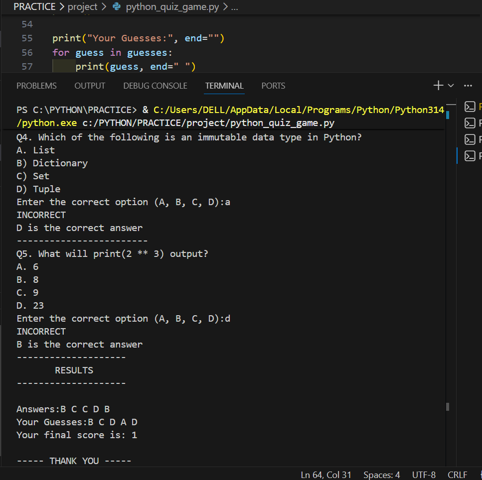

# 🧠 Python Quiz Game

A simple **command-line quiz game built with Python**.  
This program asks multiple-choice Python-related questions, checks the user's answers, and calculates the final score.

It is a beginner-friendly project that demonstrates basic Python programming concepts such as loops, conditionals, tuples, and user input.

---

## 🚀 Features

- Multiple-choice quiz questions
- Instant feedback (Correct / Incorrect)
- Score tracking system
- Displays correct answers after each question
- Shows the user's guesses at the end
- Final score summary

---

## 🛠 Built With

- Python
- Basic programming concepts:
  - Loops
  - Conditional statements
  - Tuples
  - User input handling

---

## 📸 Output Screenshot

---

## 📚 What I Learned

While building this project, I practiced:

- Writing loops using `for`
- Using `if-else` conditions
- Working with tuples
- Handling user input
- Creating simple command-line applications

---

## ⭐ Project Purpose

This project is part of my **Python learning journey**, where I build small programs to improve my programming skills and understanding of core concepts.

---

💻 Beginner Python Project
